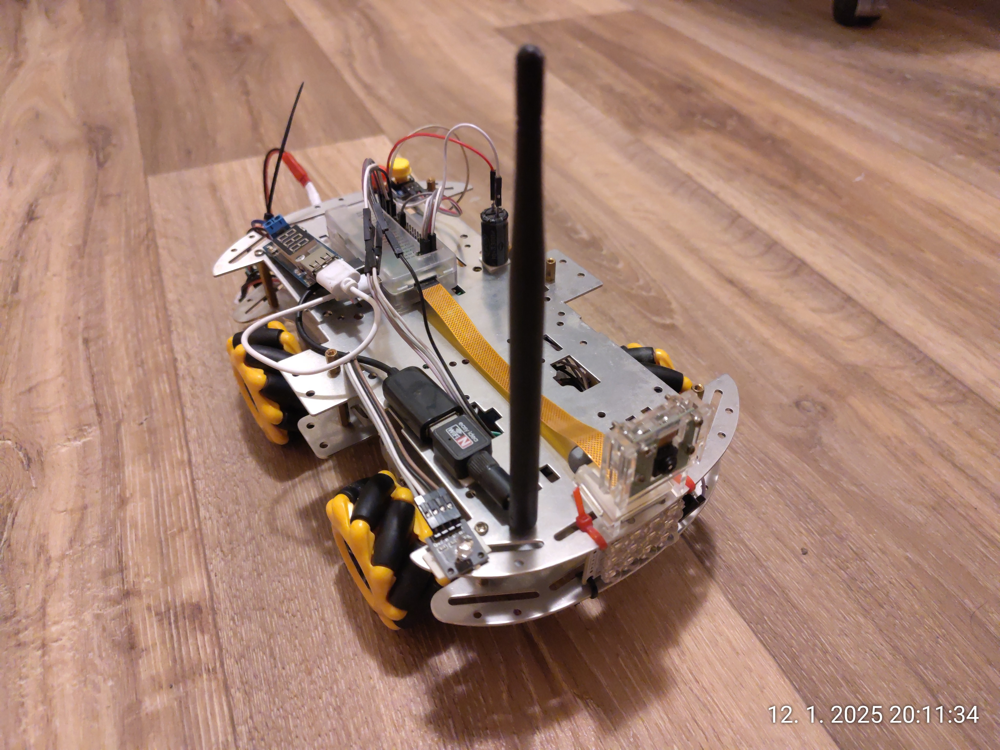
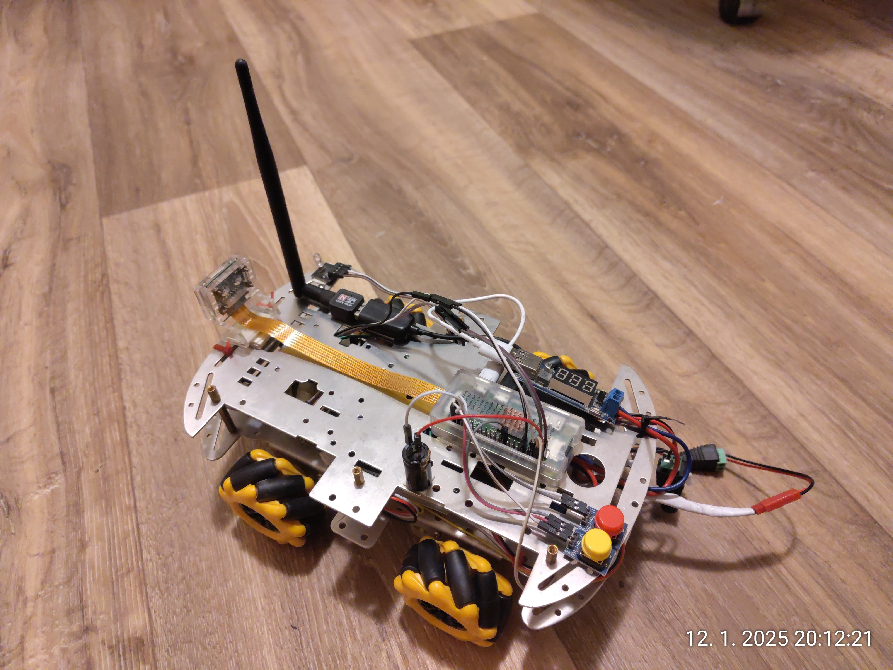
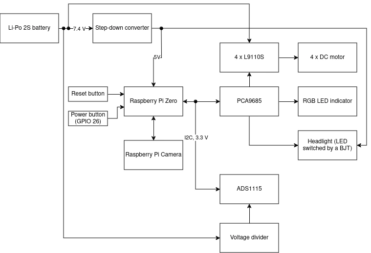

# Raspberry rover

Raspberry rover is a Raspberry pi Zero & Node-RED powered vehicle that can be controlled from any client using HTTP requests.

main features:
* 4 Mecanum wheels powered by DC motors to move around
* Raspberry Pi Camera - viewing real-time image in a web browser
* LED headlight
* Status indicating RGB LED
* Voltage sensing (voltage divider and ads1115) to monitor Li-Po battery voltage
* Reset and power-down buttons

other specs:
* Raspberry Pi Zero with external wifi adapter
* PCA9685 for PWM outputs
* 1,5 Ah 2S Li-Po with a buck converterter for power
* A generic DC motor driver board

Photo:

## Block diagram

To help you build it yourself, see image below or download it in .drawio format (https://github.com/jirkavavrik/raspberry-rover/blob/main/doc/raspberry-rover-block-diagram.drawio)

