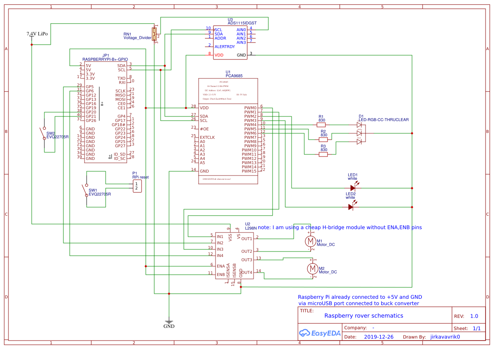

# Raspberry rover

Raspberry rover is a Raspberry pi Zero powered vehicle that can be controlled from any client using HTTP requests

main features:
* two DC motors to move around
* A Raspberry Pi Camera - viewing real-time image in a web browser
* two white leds as headlights
* a status indicating rgb led
* voltage sensing (voltage divider and ads1115) to monitor Li-Po battery voltage
* reset and power-down buttons

other specs:
* Raspberry Pi Zero with external wifi adapter
* pca9685 for PWM outputs
* 1,5 Ah 2S Li-Po with a buck converterter for power
* generic DC motor driver board

Photo:

## Schematics

See image below or download pdf (https://github.com/jirkavavrik/raspberry-rover/blob/master/doc/Schematic_Raspberry-rover.pdf)

